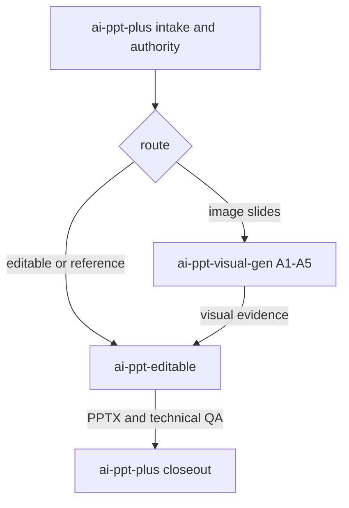

# Skill routing and ownership

The package has exactly three business skill entrypoints. Adapters and tools
sit below this layer and are not counted as skills. `GordenImage2PPTX` is a
named compatibility fallback in the engine policy, not a fourth business skill,
not a default route, and not a release authority.

| Skill | Owns | Does not own |
|---|---|---|
| `ai-ppt-plus` | intake, source authority, narrative, approved outline, route, design authority, manifest reconciliation, QA aggregation, reports, human closeout and release gates | worker-internal generation/decomposition algorithms |
| `ai-ppt-visual-gen` | A1–A5 planning and prompts, raster generation, page-local retry, generated-source retention and deck-strip review | orchestrated narrative/formal-text authority, editable reconstruction, release or human sign-off |
| `ai-ppt-editable` | reference decomposition, editable-layer/object plan, PPTX authoring/rendering and technical QA | narrative redesign, release eligibility or human sign-off |

`Presentations`, `python-pptx`, image generation, OCR, and rendering are
adapters/tools. They may implement an operation but cannot acquire business
ownership or create a fourth release authority.

## Routing rules

1. A complete deck request, source bundle, mixed route, or resumed project
   starts in `ai-ppt-plus`.
2. A request only for image-format slides or a visual intermediate may invoke
   `ai-ppt-visual-gen` directly. Under orchestration, the worker consumes the
   approved outline/design revisions and returns evidence without replacing
   them.
3. A fixed reference image, screenshot, rasterized PDF page, existing deck, or
   structured-content-to-editable-PPTX request may invoke `ai-ppt-editable`
   directly. Its standalone text authority rules must be explicit.
4. `visual-creation:image-slide` binds to `ai-ppt-visual-gen` as a checked-in
   sibling skill. Resolve the image tool at runtime: user-named compatible
   backend first, preferred native imagegen second, another native raster tool
   third, otherwise blocked/unavailable. SVG/HTML/Canvas/code-added bitmap text
   does not satisfy the generation event.
5. `reference-reconstruction`, `editable-pptx`, and `native-authoring` bind to
   `ai-ppt-editable` as a checked-in sibling skill. A fixed reference is not
   routed through whole-page visual generation merely to satisfy another path.
   `native-authoring` requires a v2 route decision with
   `visual_authority=approved_design_system`, `requires_image_generation=false`,
   and a `native_content_manifest`; it must not silently fall back to image
   generation or reference reconstruction.
6. Editable and reference routes use `ai-ppt-editable` as the primary engine.
   `GordenImage2PPTX` may run only as a recorded, region-only visual-asset
   fallback after the editable/imagegen failure decision. It is forbidden for
   formal text, semantic panels, card frames, tables, charts and whole pages.
   The fallback event must carry a reason, region, asset record and explicit
   user decision.
7. PPTX operations use the declared authoring adapter. No skill may silently
   replace the adapter, lower L0–L5 editability, or turn automated technical
   success into delivery/human approval.
7. Orchestrated results return to `ai-ppt-plus` for canonical manifest
   reconciliation, deck-wide QA, human closeout, and release eligibility.

## Shared runtime and contracts

Each skill directory contains its own versioned `scripts/`, `assets/`, and
`references/` runtime. Every package validates independently and declares the
same bundle revision. The root Super package also checks both child manifests,
entrypoints, required directories, managed files, and revision parity so copied
runtime files cannot drift silently.

Shared contracts include:

- `references/editability-levels.md` for L0–L5 semantics;
- `references/native-object-protocol.md` for native/vector/object evidence;
- `references/report-protocol.md` for automated/human/release state separation;
- `references/chart-reconstruction.md` for chart authority and representation;
- `ai-ppt-plus/visual-generation-tool/v1` for raster tool resolution,
  source retention, and no-code-overlay policy;
- font embedding/portability contracts;
- machine-readable ownership in `assets/skill-routing.template.json`;
- machine-readable engine/fallback policy in the same routing contract and
  `ai-ppt-plus/engine-route-validation/v1`.
- `ai-ppt-plus/route-decision/v2` for native-authoring route authority;
- `ai-ppt-plus/handoff/v2` for hash-backed A-to-B recovery and page coverage.
- `ai-ppt-plus/workflow-state/v1` for phase readiness, approvals and blockers.
- `ai-ppt-plus/runtime-mirror/v1` for shared-runtime SHA-256 drift checks;
- `ai-ppt-plus/environment-contract/v1` for explicit capability and renderer
  requirements.

Validate before any downstream work:

```bash
python3 scripts/validate_skill_package.py --skill-dir .
python3 scripts/validate_routing_contract.py
```

When a runtime-installed bundle exists, pass it to
`validate_skill_package.py --runtime-skill-dir`. Missing files, entrypoint
revision drift, or a managed-file hash mismatch is blocking.



Direct worker invocation omits the outer orchestrator nodes but does not relax
the worker's authority, evidence, or blocking rules.
