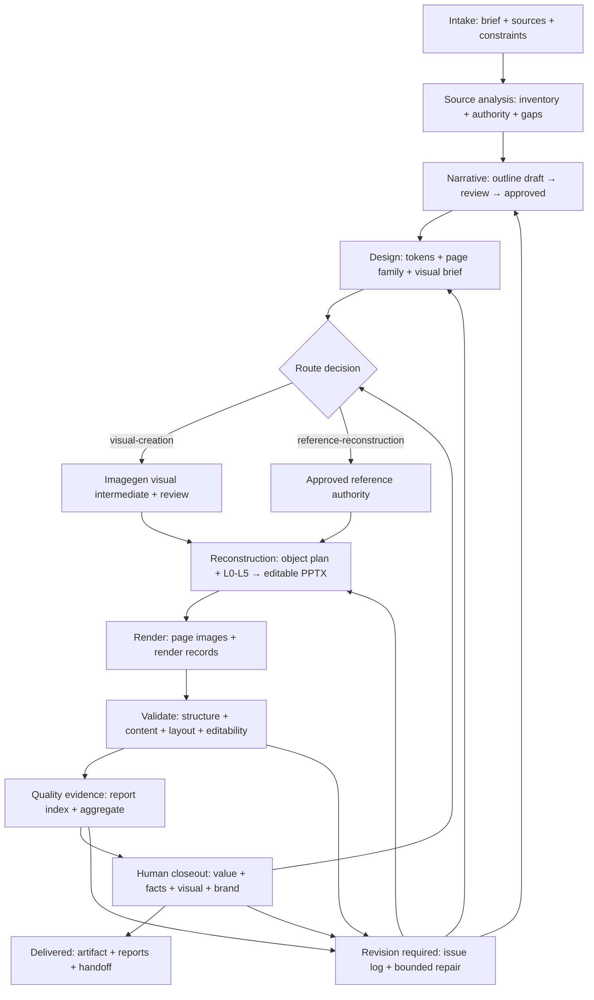
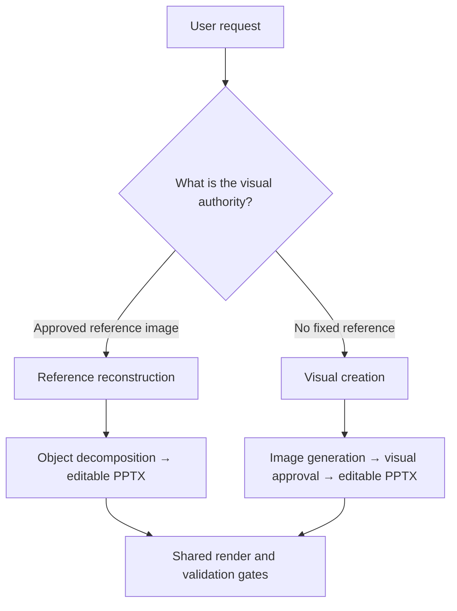

# AI PPT Plus workflow map

Use this map when starting a batch, resuming a project, or auditing a failure. A gate is a hard stop when its required evidence is missing or invalid.

## Route split

## Boundary rules

- The outline owns formal words, numbers and facts; a reference image owns layout, hierarchy and spatial relationships.
- A visual intermediate is an image-generated design artifact on the `visual-creation` route; a PPTX render or native-shape layout is not a substitute. On the `reference-reconstruction` route, the approved reference image is the visual authority and is not relabeled as a generated intermediate.
- `route-decision.json` is the routing authority. A route conflict, missing generation evidence, or missing reference roster is a hard gate before reconstruction.
- Every visible reconstruction object carries one L0-L5 editability level; page ratios are evidence, not waivers for prohibited or unresolved objects.
- Every gating report must identify the deck path and SHA-256, or delivery remains blocked as stale.
- State transitions are committed only after the owning artifact and all affected checks are updated.
- The last passing PPTX and manifests remain immutable; every repair creates a new revision.
