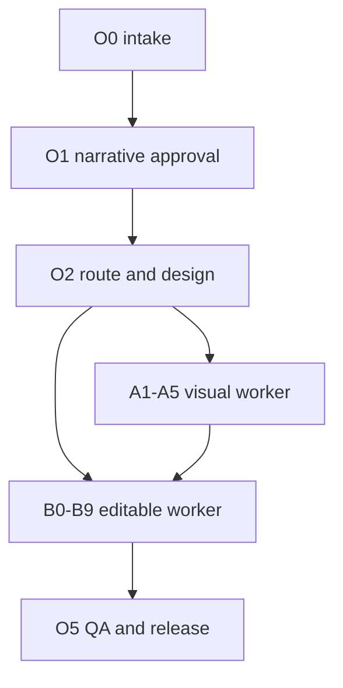

# AI PPT Plus operating matrix

This is the executable map for the three-skill bundle. Names in the `tool`
columns are repository scripts or explicit runtime adapters. The orchestrator
owns authority and release; workers own their production algorithms.

## 1. Routing and authority



| route | visual authority | formal-text authority | worker path | whole-page image allowed |
|---|---|---|---|---|
| `visual-creation` | generated visual intermediate | approved outline | A1-A5, then optional B0-B9 | yes, as an image-slide artifact only |
| `reference-reconstruction` | approved reference image | user transcription or approved copy | B0-B9 via `ai-ppt-editable` | no whole-page image; only a recorded region-only visual fallback for allowed complex assets |
| `native-authoring` | approved design system | approved structured content | B0-B1, B6-B9 | no |

The route is persisted in `route-decision/v2`. A visual reference can teach
composition and style, but it never becomes the formal copy or data authority.
Generated pixels can be visually reviewed, but they cannot overwrite approved
text, numbers, dates, chart data, or brand claims.

## 2. Orchestrator O0-O5

| stage | purpose and required actions | primary inputs | outputs/evidence | executable tools and gates | cost/cache | human checkpoint |
|---|---|---|---|---|---|---|
| O0 Restore and preflight | isolate a run, preserve originals, inventory sources, inspect package, probe environment and fonts, restore a resumable state | source files, existing handoff/state, package revision | `source-inventory`, environment report, backend binding, `workflow-state` | `validate_skill_package.py`, `validate_routing_contract.py`, `inspect_sources.py`, `probe_environment.py`, `probe_fonts.py`, `validate_workflow_state.py` | low; cacheable except live capability probe | resolve unreadable sources and missing tools |
| O1 Brief and narrative | establish audience, purpose, duration, language, density, editability target, data authority; produce and approve outline | source inventory, user constraints | `deck-brief`, outline, source references, approval record | `validate_outline.py`, outline/source contracts, issue log | low; content hash invalidates downstream narrative | explicit outline approval before production |
| O2 Route and design | select exactly one route, freeze visual/formal authorities, define ratio, palette, type, spacing, icon language and anti-template rules | approved outline, references, brand/font constraints | `route-decision/v2`, design system, registry seed | `validate_route.py`, `validate_routing_contract.py`, design-system contract | low; route/design revision is a fan-out invalidator | route confirmation and design authority approval |
| O3 Delegate visual | if `visual-creation`, execute A1-A5 page by page; retain source, copy, prompt and hashes; return failed/approved pages | route, outline, design system, visual plan | visual plan, prompts, source/copy manifest, assertions, deck strip | `$ai-ppt-visual-gen`, `run_visual_pipeline.py`, strip and assertion gates | high; prompt/page hash cache, single-page retry | approve strip and inspect every full page |
| O4 Delegate editable | consume the approved authority and build/reconstruct editable objects; preserve editability target and run technical QA | route, formal copy, references or visual intermediates, fonts | editable layout, object/asset/text manifests, PPTX, renders, worker handoff | `$ai-ppt-editable`, `compose_pptx.py`, `run_pipeline.py`, object/font/render gates | medium/high; page/object/render caches | inspect reconstructed pages and repair ownership |
| O5 Reconcile and release | reconcile manifests, aggregate reports, render final deck, review strip/full pages, record signoff and release eligibility | all worker evidence, issue log, human signoff | report index, project report, review HTML, delivery report, sealed bundle | `aggregate_project_reports.py`, `render_review_html.py`, `validate_report_bundle.py`, `delivery_check.py` | high once per release; no incremental release shortcut | final human closeout is mandatory for delivery |

### O0 state contract

`assets/workflow-state.template.json` and
`assets/schemas/workflow-state.schema.json` define the durable control plane.
The state must carry `project_id`, `run_id`, `revision`, `package_revision`,
`phase`, `route`, `page_count`, `canvas_ratio`, formal and visual authorities,
artifact paths, approvals, open blockers and `next_action`.

Use:

```bash
python3 scripts/validate_workflow_state.py PROJECT/workflow-state.json \
  --project-root PROJECT --expected-pages 6 --strict \
  --report RUN/workflow-state-validation.json
```

Strict mode verifies phase-required artifacts and their SHA-256 values. A
`revision-required` state must contain typed blockers with `severity`,
`owner_artifact` and `status`. A `delivered` state cannot contain open
blockers, unapproved authorities or missing human closeout.

## 3. Visual worker A1-A5

| stage | executable contract | required page data | tool/runtime | hard gate | reuse boundary |
|---|---|---|---|---|---|
| A1 Lock context | freeze canvas, page count, language, audience, setting, density, style lock and retry policy | generation context, ratio, palette, type, surface, icon language, avoid list | plan template, `validate_visual_generation_plan.py` | dense is default; lower density needs a reason; retry scope is `single-slide`, max 3 | deck-level context is reused; page attempt is not |
| A2 Build thick plan | convert approved copy into a distinct visual framework with a focal point, reading path, named zones, capacities and anti-template rules | `core_logic`, `layout_blueprint`, `content_model`, three reserve paragraphs, formal text, keyword map | plan JSON and design-system references | dense default: intro, four modules, two bullets/module, KPI/tag layer and conclusion when source supports it; no invented filler | unchanged pages keep their plan and image |
| A3 Materialize prompt | make every page prompt self-contained and include exact approved strings, authority, reference policy, colors and no-invention rules | materialized `production_prompt`, `prompt_file`, text whitelist, exact keyword/color mapping | `materialize_visual_generation_prompts.py` | prompt hash matches manifest; unlisted visible model text is a defect | prompt hash is the page cache key |
| A4 Generate and inspect | invoke the native raster image tool per page, retain original and project copy, inspect and retry only failed page | source/copy image, dimensions, backend/model, attempt/trigger, hashes | runtime ImageGen, `validate_visual_generation_plan.py`, `validate_visual_assertions.py` | no code/Pillow/SVG/HTML overlay; source and copy differ and decode; OCR/color/ink assertions pass or become human blockers | accepted pages are immutable during a retry |
| A5 Strip and handoff | compose complete deck strip, inspect rhythm and every full page, return handoff to Super | strip, review status, approved/failed pages, unresolved issues | `build_visual_generation_strip.py`, `compose_image_pptx.py`, `run_visual_pipeline.py` | strip covers exactly all pages; full-page review remains separate from strip approval | deck strip is regenerated only when page set or page images change |

The visual worker does not call a fake image backend. Native image generation is
an external runtime event and must be recorded in the manifest. If it is
unavailable, the result is `blocked` or a clearly labeled degraded wireframe,
never a code-drawn substitute.

## 4. Editable worker B0-B9

The current editable entrypoint presents these mechanics as E0-E5 ownership
stages. The following B0-B9 table is the detailed reconstruction sequence
inside that worker.

| stage | operation | primary evidence/tool | quality rule |
|---|---|---|---|
| B0 | create unique run root, preserve input, view the current source page and validate handoff | `validate_handoff.py`, `inspect_sources.py`, `view_image` runtime adapter | never edit a fixed history directory or use chat memory as source |
| B1 | sample palette and typography context | `probe_palette.py`, font probe, design system | palette is evidence, not a license to redesign |
| B2 | reproduce clean background | background/image-generation asset event, source hash | keep background separate from text, frame and icons |
| B3 | generate or recover the framework/skeleton layer | native shapes/groups/tables first; imagegen/assets manifests for complex visuals | simple cards, panels, titles, dividers, process nodes and table grids are native semantic objects by default; only text-free complex visual substrate may remain an independent image |
| B4 | generate/recover icons, decorations and artistic words | native image-generation event, `chroma_key.py`, `frame_parts_to_icons.py`, `audit_icon_layers.py` | independent semantic assets stay independently movable; no duplicate or green fringe |
| B5 | remove background and slice only approved assets | `chroma_key.py`, `slice_grid.py`, `extract_panels.py` | every crop has source bbox, source hash and asset provenance |
| B6 | map source coordinates to the target slide | `image_viewport.py`, `layout_guard.py`, `placement_qa.py` | preserve ratio, margins, anchors and reading path |
| B7 | extract formal text and style runs | GPT vision/OCR proposal, `ocr_text_check.py`, `text_model.py` | approved/user text wins; OCR uncertainty is surfaced, not silently accepted |
| B7a | guard layout and text placement | `layout_guard.py`, `validate_text_style_map.py`, `validate_typography_calibration.py` | no overflow, clipping, line-break drift or missing emphasis |
| B7b | verify placement | `placement_qa.py`, render comparison | fix the owning bbox/object, not a downstream symptom |
| B7c | correct frame anchor if needed | frame/object placement evidence | correct anchor without changing the approved composition |
| B8 | compose native PPTX objects | `compose_pptx.py`, `authoring_backend.py`, `pptx_primitives.py`, `component_expander.py` | text, simple panels/cards and verified tables/charts are native; icons, gradients and complex art remain independent movable assets; fallback is never silent |
| B9 | render, inspect, compare and hand off | `render_pptx.py`, `inspect_pptx.py`, `semantic_object_audit.py`, `visual_compare_qa.py`, font and report gates | technical pass, human visual review and release eligibility are separate |

The B2-B8 image-to-PPTX algorithm is a protected boundary. This architecture
work adds contracts, observability and routing around it; it does not rewrite
the decomposition, chroma-key, composition, rendering or font algorithms.

## 5. Toolchain by layer

| layer | tools | role | expensive failure mode | control |
|---|---|---|---|---|
| source/intake | Markdown/JSON/YAML, PDF/DOCX/XLSX/CSV/images/PPTX, `inspect_sources.py` | authority inventory, readable extraction and source hashing | wrong source or unresolved conflict | source inventory plus explicit authority |
| narrative/design | outline/design-system/route templates, `validate_outline.py`, `validate_route.py` | story, route, palette, density and reference policy | rework fan-out after late route change | approve and hash before delegation |
| raster visual | native ImageGen, prompt materializer, Pillow only for inspection/assembly | high-density image slide generation and source retention | model latency, text errors, style drift | page-local retry, prompt hash, OCR/color assertions, strip |
| editable authoring | Python 3.11+, `python-pptx`, OOXML, authoring adapter and primitives | native text/shapes/charts/tables and movable assets | wrong object class or uneditable screenshot | L0-L5 object manifest and semantic audit |
| image/assets | Pillow, NumPy, CairoSVG/Inkscape, chroma-key and slicing scripts | inspect or isolate visual assets | halo, duplicate, crop or anchor drift | asset manifest, bbox/hash, layer audit |
| render | LibreOffice/`soffice`, Poppler `pdftoppm`/`pdftocairo` | authoritative rendered pixels | missing binary, font fallback, full-deck conversion cost | environment contract, render/page cache, font triple gate |
| OCR/fonts | Tesseract, fontconfig, Noto Sans CJK, fonttools | readback and portability evidence | unavailable OCR or CJK substitution | label unavailable, require human review, embed/check fonts in release |
| QA/report | SHA-256, manifests, `pipeline_engine.py`, report bundle and review HTML | cross-artifact consistency and release proof | stale report or missing downstream evidence | atomic outputs, report hashes, final bundle sealing |
| CI | GitHub Actions, pinned `requirements-ci.txt`, package validators and executable tests | repeatable regression and package drift detection | environment drift and serial subprocess overhead | environment contract, mirror lock, parallel test runner |

## 6. Execution profiles and invalidation

### Draft / local iteration

Use DAG mode, content-addressed cache and affected-page/region selection. Run
structural gates and affected renders. Do not label the result released.

```bash
python3 scripts/run_pipeline.py PROJECT --deck deck.pptx --expected-pages 6 \
  --execution-mode dag --affected-pages 2,5-6 \
  --affected-region hero=80,120,640,260 --page-cache-dir PROJECT/.pipeline-cache/render-pages
```

### Review

Run the worker handoff, full applicable technical QA, a complete visual strip
and human page review. Keep `human_review_status=pending` until a reviewer
records the result.

### Release

Run without affected-page narrowing, require the workflow state, full render,
font delivery, semantic object, manifest registry, report bundle and signoff.
The release gate runs once after all inputs are sealed; the bundle validator
then verifies its final hashes.

### Invalidation rules

| change | invalidate | retain |
|---|---|---|
| source/brief/outline/formal copy | O1 onward, affected pages and their B objects | unrelated accepted source evidence |
| route or design-system revision | all downstream visual and editable work | source inventory and prior run for comparison |
| one visual prompt/image | that A page, its strip and corresponding B page | other A pages and their hashes |
| one asset crop/bbox | that asset and associated B page/regions | unrelated pages |
| one text/layout object | affected B page, render and page-local QA | other pages and source images |
| font/renderer/theme | all render pixels and font gates; retain semantic plans | source/plan/object manifests |
| release metadata/signoff | report aggregation and release gates only | rendered deck and technical evidence |

`PipelineExecutor` reports wall time, task-time sum, cache hits/misses and
critical-path time. A cache hit must restore verified outputs; failed or
static condition nodes are never cached. Final release still requires one
full-deck verification even after a successful incremental run.

## 7. Failure and recovery rules

1. Stop at the first authority, route, package, environment or hash blocker.
2. Attach every issue to an owning stage/artifact, severity and status.
3. Repair only the owning stage, rerun its affected descendants, and preserve
   accepted pages and immutable source copies.
4. A page-generation failure retries only that page, at most three attempts;
   a reconstruction failure reruns the affected B stages and gates.
5. After three repair rounds or a newly introduced critical issue, return to
   `revision-required` and ask for a decision; do not silently downgrade the
   requested output.
6. Never turn a technical pass into human approval, or an image-only PPTX into
   an editable PPTX claim.
