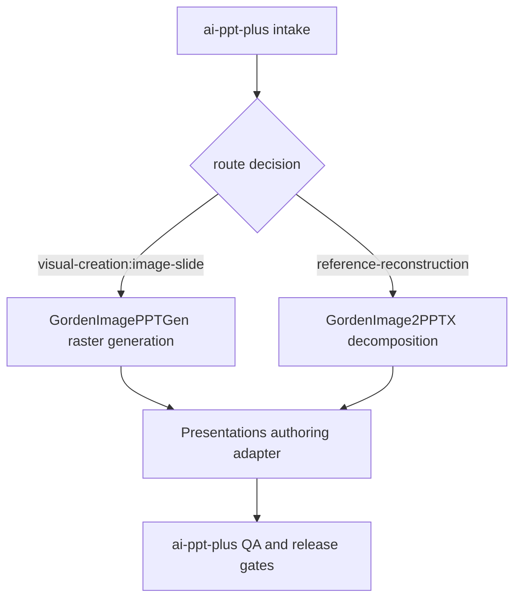

# Skill routing and ownership

The project has one orchestration owner and three capability layers. A request
may pass through several layers, but each contract has one source of truth.

| Skill | Owns | Does not own |
|---|---|---|
| `ai-ppt-plus` | intake, source authority, narrative/outline, route decision, design system, visual-generation plan/prompt/evidence, manifests, QA orchestration, report aggregation, human closeout and release gates | low-level shape-writing implementation details or image-only reconstruction internals |
| `GordenImagePPTGen` | the delegated raster visual-generation event and retention of the generated source image | narrative/formal-text authority, image-to-editable-PPTX reconstruction, release eligibility or human sign-off |
| `GordenImage2PPTX` | image/screenshot/reference decomposition into background, frame, icon/asset and formal-text layers; reconstruction-specific object plan and editable PPTX output | narrative redesign, release eligibility, human sign-off, or a second definition of the backend contract |
| `Presentations` | low-level PPTX/Google Slides creation, mutation, rendering and package manipulation through the selected authoring adapter | choosing the story, deciding the visual route, defining editability policy, or claiming QA/release completion |

## Routing rules

1. A topic, outline, source bundle, or existing deck starts in
   `ai-ppt-plus`.
2. A fixed slide image or screenshot that must be reconstructed is delegated to
   `GordenImage2PPTX` for decomposition. The formal text authority remains the
   approved outline or user transcription, not generated pixels.
3. A new `visual-creation:image-slide` request delegates the actual raster
   generation to `GordenImagePPTGen` through the `visual_generation` binding.
   Resolve the tool at runtime using the user-named backend first, Codex's
   preferred `imagegen` tool second, another native raster tool third, and
   otherwise record an unavailable/blocked generation state. SVG/HTML/Canvas
   drawings and code-patched bitmap text do not satisfy this binding.
4. PPTX object creation/editing is performed through the presentation
   capability exposed by `Presentations` or the explicitly selected adapter.
5. The result returns to `ai-ppt-plus` for manifest reconciliation, rendering,
   structural/visual checks, report aggregation, human review and release.
6. The runner must validate the discovered backend against the declared
   `authoring` binding before any downstream gate. No child skill may silently replace the selected authoring backend, lower the
   L0-L5 editability standard, or turn an automated pass into a delivery claim.

## Shared contracts

These contracts are project-level and must be consumed by all routes:

- `references/editability-levels.md` defines L0-L5 and the distinction between
  editable content, movable assets and component editability.
- `references/native-object-protocol.md` defines native shapes, groups, tables,
  charts and vector asset evidence.
- `references/report-protocol.md` defines the normalized report envelope and
  the technical/human/release state split.
- `references/chart-reconstruction.md` defines chart data authority,
  representation selection, missing-value handling and chart-specific QA.
- `ai-ppt-plus/visual-generation-tool/v1` defines the runtime raster-tool
  resolution order, source-retention requirement and no-code-overlay boundary
  for the `GordenImagePPTGen` visual path.
- `references/font-embedding.md` and `references/font-portability.md` define
  the font evidence and delivery restrictions.

The machine-readable ownership map is kept in
`assets/skill-routing.template.json` so a future adapter can validate its
declared scope before it is selected.

## Executable contract

The checked-in package is the source of truth for the orchestrator and its
managed routing rules. Validate both contracts before intake or authoring:

```bash
python scripts/validate_skill_package.py --skill-dir .
python scripts/validate_routing_contract.py
```

`validate_skill_package.py` checks the package revision and SHA-256 of every
managed file. When a runtime-installed copy is known, pass
`--runtime-skill-dir RUNTIME_DIR`; a missing or stale runtime file is a
blocking drift, not a warning. `run_pipeline.py` runs this contract as its
first prerequisite and includes the managed files in cache inputs.

The route graph is intentionally small and explicit:



The route validator rejects undeclared ownership, missing backend bindings,
and a non-`decided` route. The pipeline also binds a reference roster to its
source hashes and makes the supplied route a prerequisite for every
downstream task; an invalid route therefore cannot be treated as advisory
metadata. The roster's `path` is the original authoritative source. A
normalized comparison image, when needed, must be recorded separately as
`comparison_path` with its own hash and `derived_from_sha256`; it must not
replace the source authority.
